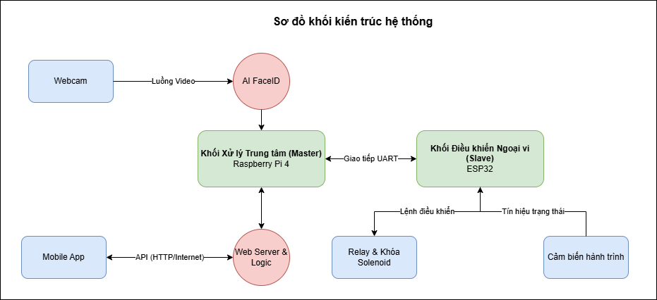
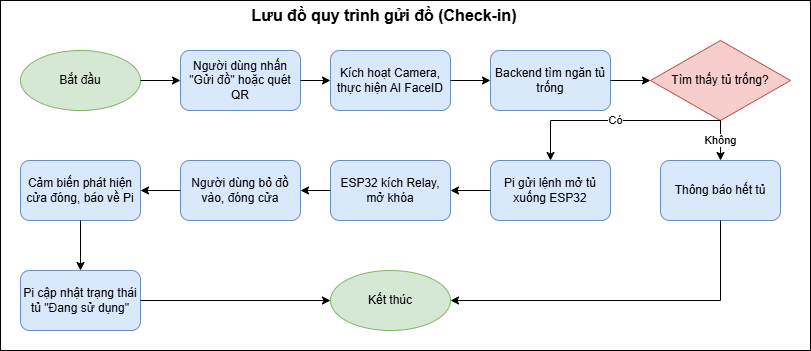
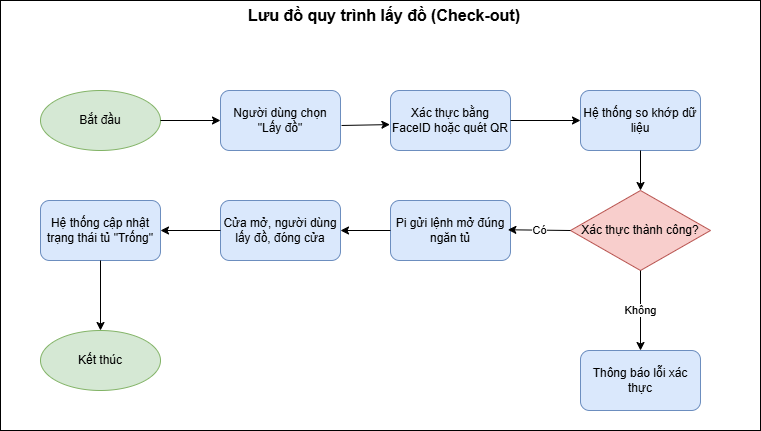

# Face Locker - Smart Locker System with AI FaceID and Mobile App

A smart centralized locker management system that combines AI-powered facial recognition with an IoT mobile application, delivering a seamless and keyless storage experience.

## About the Project

Face Locker is an automated locker system built on a centralized Kiosk model. The idea is simple: use a single processor and one camera to manage multiple locker compartments. This approach keeps costs down while making the system practical for real-world deployment in places like supermarkets and shopping centers.

## What It Does

The system offers smart storage where users do not need physical keys. It automatically finds an empty locker and assigns it to you. For authentication, we support two methods: AI-based facial recognition (FaceID) that lets you open your locker just by looking at the camera, and a mobile app that generates QR codes for locker selection or remote unlocking.

Real-time monitoring is built in. Door sensors track whether each locker is open or closed, and LED indicators show which compartments are occupied. For administrators, there is a dashboard that displays usage statistics, tracks compartment status, and sends alerts when something goes wrong like hardware faults or tampering attempts.

## How It Works

### System Architecture

The system follows a master-slave architecture:

The master unit runs on a Raspberry Pi 4. This is where all the heavy lifting happens. It processes the video stream from the webcam for facial recognition, runs the web server that communicates with the mobile app over the internet, and handles the logic for allocating lockers to users.

The slave unit is an ARM ESP32 board. It acts as the physical controller. It receives commands from the Raspberry Pi through UART, controls the relay modules to unlock doors, and reads the limit switch sensors to monitor door status. It then sends this feedback back to the Pi.

### Check-in Process

When a user wants to deposit items, they press the deposit button on the touchscreen or through the app. The system activates the camera and runs FaceID to capture the facial feature vector. The backend queries the database to find an available compartment. Once found, the Pi sends a UART packet with the locker ID and unlock command to the ESP32. The ESP32 activates the relay, which opens the solenoid lock. After the user places their items and closes the door, the limit switch detects the closure. The ESP32 sends a signal back to the Pi, which updates the database to mark that locker as in use.

### Check-out Process

To retrieve items, the user selects the retrieve option and authenticates using FaceID or by scanning a QR code from the app. The system compares the data with what was stored during check-in. If it matches, the Pi sends the unlock command for that specific compartment to the ESP32. The door opens, the user takes their items and closes the door. The system then updates the locker status back to available and archives the session.

## User Stories

The following table summarizes all user stories for the system:

| ID   | Feature Group | Actor    | User Story                                                 | Technical Details                                                                                                                                     |
| ---- | ------------- | -------- | ---------------------------------------------------------- | ----------------------------------------------------------------------------------------------------------------------------------------------------- |
| US01 | Check-in      | Customer | Deposit items quickly using AI FaceID                      | Camera scans face -> Pi extracts vector -> Backend finds empty locker -> UART unlock command -> Sensor confirms door closed -> DB updates to "In Use" |
| US02 | Check-in      | Customer | Authenticate deposit using QR code from App                | App creates Dynamic QR -> Camera decodes on-site -> Pi verifies user via API -> Locker allocation same as FaceID                                      |
| US03 | Usage         | Customer | Add more items to a rented locker (Update)                 | Select "Add Items" -> Authenticate with FaceID/QR -> System opens same locker without ending session                                                  |
| US04 | Check-out     | Customer | Retrieve items safely with dual authentication (FaceID/QR) | Verify face -> Match with vector from check-in -> UART opens correct compartment -> DB updates to "Available"                                         |
| US05 | Admin (CRUD)  | Admin    | CRUD: Add/Edit/Delete/View locker list                     | Dashboard operations -> Change compartment count, locker ID, or ESP32 GPIO pin config in DB                                                           |
| US06 | Admin         | Admin    | Force open a specific locker                               | Admin selects locker on Dashboard -> Backend sends priority bypass command -> Pi tells ESP32 to activate relay immediately                            |
| US07 | Admin         | Admin    | Disable a malfunctioning locker                            | Change compartment status in DB to "Maintenance" -> System will not assign to new customers                                                           |
| US08 | Monitoring    | Admin    | View usage charts and logs                                 | Backend queries transaction history -> App displays usage frequency and real-time vacancy rates                                                       |
| US09 | Security      | System   | Automatic alert on tampering/lock jam detection            | Limit switch state changes without unlock command -> ESP32 sends urgent interrupt -> Dashboard/App shows red alert                                    |
| US10 | Registration  | Customer | Face registration for future recognition                   | Camera captures image -> Pi runs preliminary training (fine-tuning) or stores face vector in DB for later recognition                                 |

## Database Design

The database consists of six main tables:

The Users table stores user information including ID, email, password hash, full name, phone number, role (customer or admin), active status, and timestamps.

The Lockers table tracks each locker compartment with its code, physical location, size, ESP32 device ID, relay pin, sensor pin, status (available, in use, or maintenance), door state, and timestamps.

The Locker Sessions table is central to the system. It links users and lockers, stores the authentication method used, the face vector (when using FaceID), the face image path, session status, check-in and check-out timestamps, and the last access time for update operations.

The QR Tokens table manages dynamic QR codes generated by the app, with the user ID, token string, expiration time, and usage status.

The Transaction Logs table records all actions including session ID, locker ID, user ID, action type, authentication method, additional details in JSON format, device info, and timestamp.

The Security Alerts table tracks incidents like unauthorized openings, tampering, sensor malfunctions, or lock jams, with severity levels, descriptions, resolution status, and who resolved the issue.

## Technical Details

### Hardware and Circuits

The hardware includes a locker frame with 12V solenoid locks and limit switches at each compartment. A relay module circuit handles lock activation since microcontrollers cannot directly supply enough current for the solenoids. The power supply provides 12V for the locks and 5V or 3.3V for the microcontrollers. UART wiring connects the Raspberry Pi to the ESP32.

### Embedded Systems and Firmware

The ESP32 firmware configures GPIO pins for relay output and sensor input with interrupts. The UART protocol uses a frame structure with header, command, data, and checksum fields. The code also handles hardware errors like lock jamming.

### AI and Backend

On the AI side, the system collects face data and trains or fine-tunes the recognition model to run on the Raspberry Pi. Inference time is optimized for the embedded environment. The backend manages the SQLite or MySQL database, implements the smart locker allocation algorithm, and provides APIs for the mobile app.

### Mobile Application

The mobile app generates dynamic QR codes for authentication, displays real-time locker status visually, and shows usage statistics along with hardware fault alerts.

## Development Timeline

Week 1 focuses on requirement analysis, system diagram design, and material planning. Week 2 covers environment setup, basic hardware assembly, and component research. Week 3 involves collecting and processing face image data and programming the ESP32. Week 4 handles database design, system diagrams, and defining main functional flows. Week 5 is for designing the mobile app user interface.

Week 6 is dedicated to researching and building the AI face recognition model. Week 7 focuses on building the backend, API, and device communication logic. Week 8 connects the frontend to the backend and completes mobile app functions. Week 9 optimizes the AI model and refines hardware stability. Week 10 and beyond covers system integration, overall testing, and completing the report and presentation.

## Team Members

| Name                 | Class   | Section |
| -------------------- | ------- | ------- |
| Duong Van Chi Bao    | 23T_DT4 | 23Nh15A |
| Vo Hoang Thai Bao    | 23T_DT4 | 23Nh15A |
| Huynh Ngoc Tien Nhat | 23T_DT4 | 23Nh15A |
| Mai Thanh Tan        | 23T_DT4 | 23Nh15A |

## References

1. A. Bahga and V. Madisetti, Internet of Things: A Hands-on Approach. Vpt, 2014.
2. OASIS Standard, "MQTT Version 5.0," OASIS, Mar. 2019.
3. Raspberry Pi Foundation, "Raspberry Pi 4 Model B Datasheet," 2019.
4. Espressif Systems, "ESP32 Series Datasheet," ver. 3.7, 2023.

---

PBL5 Project - Group 6

Da Nang University of Science and Technology
